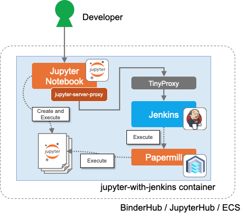

# jupyter-with-jenkins [](https://mybinder.org/v2/gh/JulioCesar82/jupyter-with-jenkins/master?urlpath=tree)
Jupyter with Jenkins to perform daily tasks easily

# Design



# Getting started jupyter-with-jenkins with MyBinder

To launch jupyter-with-jenkins, simply click the binder button:
[](https://mybinder.org/v2/gh/JulioCesar82/jupyter-with-jenkins/master?urlpath=tree)

After Jupyter Notebook is open, you can open the Jenkins UI from the `jenkins` menu.


## Using Selenium

The notebook [Using Selenium.ipynb](Using%20Selenium.ipynb) shows you how to use Selenium from Jupyter Notebook.

## Running notebook periodically

You can use [papermill](https://github.com/nteract/papermill) to let Jenkins execute your notebook.

```
# Move notebook directory
cd /home/jovyan/

# Execute notebook
papermill "Using Selenium.ipynb" "${WORKSPACE}/${BUILD_ID}.ipynb"
```

# Deploy jupyter-with-jenkins to your environment

## On Your Docker Engine

Create a working directory and perform the following:

```
$ cd (working directory)
$ docker run -d -p 8888:8888 -v $(pwd):/home/jovyan --name jupyter-with-jenkins JulioCesar82/jupyter-with-jenkins
```

Once this is done, jupyter-with-jenkins will start working on port 8888. Open `http://localhost:8888`.
When asked for a Token, use the `docker logs` to see the container's log.

```
$ docker logs jupyter-with-jenkins
...
    Or copy and paste one of these URLs:
        http://xxxxxxxxxxxx:8888/?token=xxxxxxxxxxxxxxxxxxxxxxxxxxxxxxxxxxxxxxxxxxxxxxxx
     or http://127.0.0.1:8888/?token=xxxxxxxxxxxxxxxxxxxxxxxxxxxxxxxxxxxxxxxxxxxxxxxx
```

Enter the `token string` part of the above `token=token string` into the browser.


## On Amazon Elastic Container Service

Jupyter Notebook [Run Container on AWS ECS.ipynb](Run%20Container%20on%20AWS%20ECS.ipynb) provides a way to run jupyter-with-jenkins container on the AWS Elastic Container Service.


